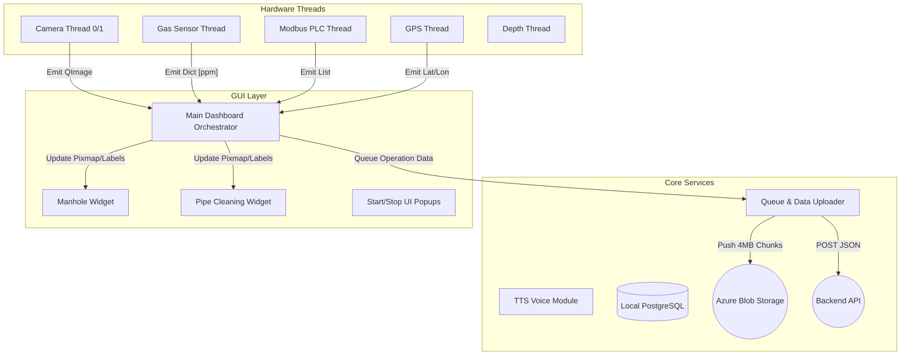
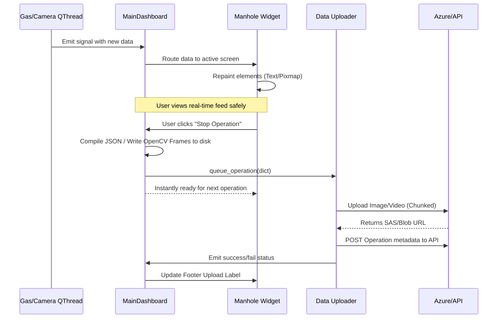
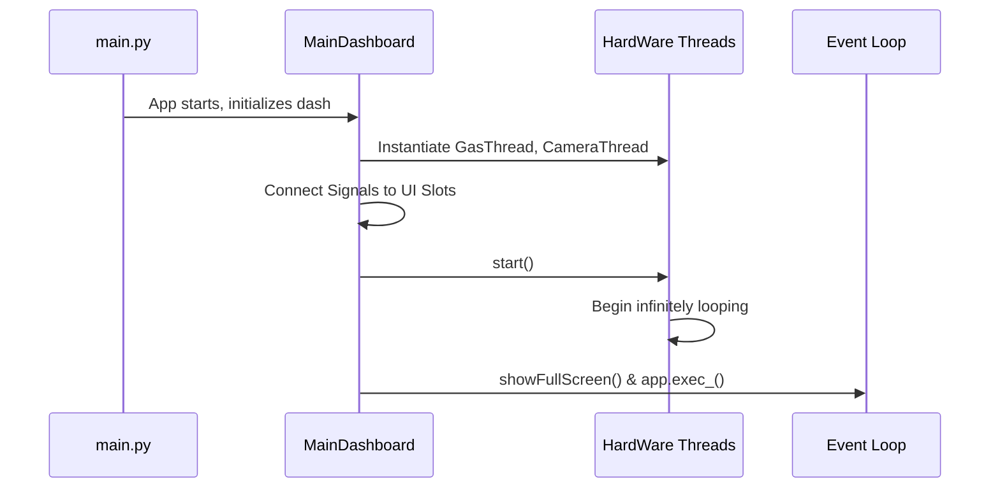
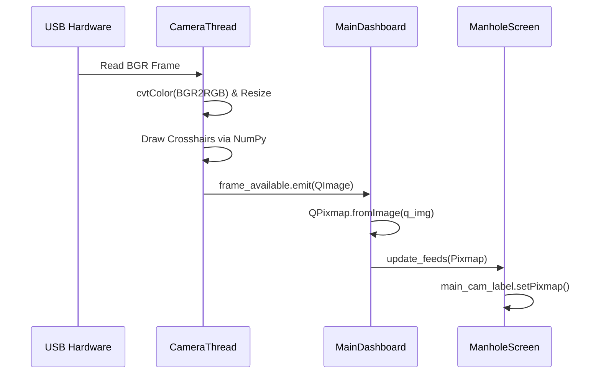

# Project Shudh: Enterprise Knowledge Transfer (KT) Document

**Confidential / Internal Engineering Handbook**
**Target Audience:** Software Engineers, Systems Architects, and Robotics Developers
**Goal:** Zero-to-Full Contributor Onboarding Guide

---

## 1. Executive Summary

### The Business Problem
Manual sewage and manhole cleaning is a fundamentally hazardous and often illegal operation worldwide. It exposes human workers to lethal toxic gases, unpredictable flow rates, and extreme physical constraints. Traditional cleaning lacks traceability, accountability, and real-time environmental monitoring.

### The Project Shudh Solution
Project Shudh replaces human entry with a teleoperated robotic crawling system. To control this robot and verify its operations, we built a **Mission Control Dashboard**. 

### System Goals
1. **Uncompromising Safety:** Provide real-time, low-latency telemetry for toxic gases (H2S, CH4, CO) to warn operators immediately.
2. **Indisputable Traceability:** Mandate before/after photographic and video evidence, coupled with precise GPS mapping and temporal logging.
3. **Automated Auditing:** Seamlessly package and synchronize multi-gigabyte inspection operations to Microsoft Azure Cloud and a central Postgres warehouse without manual intervention, overcoming unreliable field networks.

---

## 2. System Architecture

Project Shudh is designed as a **Decoupled Asynchronous System** using a multi-threaded Desktop Application Architecture over PyQt5. 

### Layer Separation
1. **Presentation Layer (GUI - PyQt5):** The main thread rendering the visual state. It never performs blocking I/O.
2. **Hardware Integration Layer (QThreads):** Dedicated worker threads communicating with physical serial buses (Sensors/Modbus) and video capture cards (USB Cameras/V4L2).
3. **Service Layer (Core):** Background services managing state perseverance, voice synthesis, and durable REST/Azure blob cloud syncing.

### Architectural Rationale
Why `QThread` and Signals/Slots? Standard Python threading runs afoul of GUI main-loop constraints. `serial.readline()` or `cv2.VideoCapture.read()` are blocking calls. If executed on the main UI thread, a disconnected camera or a stalled serial port would instantly freeze the entire application. We isolate producers (Hardware) from consumers (UI) using `pyqtSignal` events, ensuring 30-60 FPS UI performance regardless of backend I/O lag.



---

## 3. End-to-End Data Flow

The data flow relies heavily on event-driven state hydration.

1. **Hardware Ingestion:** A `QThread` loops infinitely, polling a device (e.g., `/dev/video0` or `/dev/ttyUSB0`).
2. **Translation & Emission:** The thread parses raw bytes into native Python/Qt objects (`QImage`, `dict`) and emits a heavily typed `pyqtSignal`.
3. **Orchestration:** `MainDashboard` captures the signal. It caches the latest value in memory (e.g., `self.latest_gas_data`) and propagates the data down to the currently visible QStackedWidget screen.
4. **UI Repaint:** The screen (`ManholeWidget`) updates a `QLabel` or progress bar.
5. **Operation Finalization:** When the user clicks "Stop Operation", the orchestrated state (averages of data accrued over time, captured frames) is bundled into a JSON payload.
6. **Background Sync:** The bundle is pushed to `Uploader.operation_queue`. The UI immediately frees up. A background worker picks up the data and handles retry-based Azure block string transfers.



---

## 4. Deep Component Breakdown

### `gui/` (Presentation Layer)
Everything visual. Heavily styled via PyQt `setStyleSheet`.
*   **`dashboard.py` (The Brain):** Subclasses `QMainWindow`. Holds references to all hardware threads and the background uploader. Uses a `QStackedWidget` to seamlessly hotswap between the Manhole and Pipe inspection screens. Crucially, its `closeEvent` ensures all hardware threads are gracefully killed.
*   **`screens/`:** Contains macro-views. For example, `main_screen.py` handles the logic for storing before/after frames and managing the physical operational timer.
*   **`widgets/`:** Micro-components. Custom implementations for gauges or status lights to maintain visual consistency.

### `hardware/` (Device Ingestion Layer)
All classes here inherit from `QThread`. No UI logic belongs here.
*   **`camera_thread.py`:** Initiates `cv2.VideoCapture`. Handles `BGR2RGB` conversion, crosshair burning onto frames, and graceful fallback to a "No Signal" simulation matrix if the lens disconnects.
*   **`gas_thread.py`:** Handles PySerial communication to an ESP32. Parses Regex strings to extract H2S, CO, and CH4 values. Incorporates a dynamic pause/resume capability to release ports if needed.
*   **`modbus_thread.py` & `gps_thread.py`:** Standard serial polling with deep `try/except` wrapping to prevent random byte noise from causing thread crashes.

### `core/` (Business Logic & External Sync)
*   **`data_uploader.py`:** An asynchronous producer-consumer queue. It takes heavy network calls off the main thread. Responsible for generating SAS logic, handling Azure blob configurations, and formatting JSON structures exactly as the Enterprise backend expects.
*   **`voice_module.py`:** Leverages TTS (espeak-ng) to provide English and Telugu spoken alerts asynchronously, crucial for operators in noisy outdoor environments keeping their eyes on the robot rather than the screen.

---

## 5. Deep Code Walkthrough

### The Entry Point: `main.py`
**Why QWebEngineView import order matters:**
```python
os.environ.setdefault("QTWEBENGINE_CHROMIUM_FLAGS", "--no-sandbox")
from PyQt5.QtWebEngineWidgets import QWebEngineView  
from PyQt5.QtWidgets import QApplication
```
QtWebEngine wraps an embedded Chromium browser instance. It requires initializing underlying internal C++ Chromium structures *before* the main Qt Application is instantiated. Importing it after `QApplication(sys.argv)` yields a catastrophic `SIGABRT` core dump on Linux. 

### The Orchestrator: `gui/dashboard.py`
**Thread Orchestration & Signal Routing:**
The `__init__` block is a masterclass in thread decoupling.
```python
self.gas_thread = GasThread()
# We connect the single thread's output to TWO consumers:
# 1. Update the UI gauge via pipe_screen
self.gas_thread.data_received.connect(self.pipe_screen.update_gas_data)
# 2. Store the data internally in the Dashboard for later cloud syncing
self.gas_thread.data_received.connect(self._handle_gas_update)
self.gas_thread.start()
```
The dashboard centralizes state. Instead of screens querying hardware, the dashboard receives the signal and pushes the data downwards.

### The Camera Pipeline: `hardware/camera_thread.py`
**Capture Loop:**
```python
frame_rgb = cv2.cvtColor(frame_resized, cv2.COLOR_BGR2RGB)
h, w, ch = frame_rgb.shape
# Prevent memory leaks by deep-copying the QImage out of the thread
q_img = QImage(frame_rgb.data, w, h, ch * w, QImage.Format_RGB888)
self.frame_available.emit(q_img.copy(), self.camera_index)
```
OpenCV uses `BGR` color space, while PyQt requires `RGB`. This translation happens in the background thread. We emit `.copy()` because if the OpenCV thread advances and mutates the NumPy array buffer while PyQt is rendering it, tearing or segmentation faults occur.

### Sensor Resiliency: `hardware/gas_thread.py`
**Retry Mechanism & Error Handling:**
```python
if not os.path.exists(self.port):
    time.sleep(3)
    continue # Loop forever until the USB is physically plugged in
```
When working with Edge Robotics, cables detach. The gas thread `run()` wrapper includes an infinite `while self.running:` loop checking for `os.path.exists()`. If the serial read times out (`_no_data_ticks >= 5000`), the thread forcibly closes the serial session and attempts to reconstruct it. 

### Cloud Packaging: `core/data_uploader.py`
**Azure Upload Flow & Chunking Strategy:**
```python
if file_type == "video" and file_size > self.video_chunk_threshold: # > 10MB
    success = self._upload_file_in_chunks_streaming(file_path, blob_name, content_type)
```
Instead of pushing a 300MB `mp4` file into RAM and uploading, the `_upload_file_in_chunks_streaming` mechanism reads exactly `4MB` (`self.chunk_size`) off the disk. It utilizes Azure's `stage_block` API to upload sequentially. If power fails on the Jetson Nano, RAM usage never spiked beyond the 4MB window, preventing Out-Of-Memory (OOM) OS freezes.

---

## 6. Sequence Diagrams

### a) Application Startup Lifecycle


### b) Camera Frame Pipeline


---

## 7. Threading & Concurrency Model

### The Prime Directive: Free the UI Thread
PyQt operates an Event Loop. Every time a button is clicked, an animation runs, or a frame renders, it occupies the main loop.
- **Rule:** If you execute `time.sleep(1)` on the UI thread, the entire visual application completely freezes for 1 second.
- **Solution:** We dispatch hardware and API requests to worker threads. A Signal in Qt is thread-safe. When `Thread A` emits a signal, Qt intercepts it, ferries it across the thread boundary, and queues it to be executed safely on `Thread B` (the main thread).

**Failure Scenarios:**
If you directly call `self.main_camera_label.setPixmap()` from inside `camera_thread.py`, you bypass the Qt thread-safety mechanisms. The application will unexpectedly crash with a raw `Segmentation fault (core dumped)`. 

---

## 8. Error Handling & Fault Tolerance

The physical robot environment is hostile. Our code assumes hardware will fail.

*   **Camera Fallback:** If `/dev/video0` is destroyed, `camera_thread.py` emits a warning and triggers `_emit_simulation_frame()`. This creates a black NumPy matrix with a "No Signal" overlay. The UI keeps ticking, preventing the app from crashing due to a missing component.
*   **Serial Retry Patterns:** The Modbus and Gas threads intercept `serial.SerialException`. They release the file descriptor and enter an exponential backoff loop until the Linux networking stack reassigns the `ttyUSB` port.
*   **Upload Retries:** `data_uploader.py` wraps `stage_block` calls in timeouts. If a 4MB chunk transmission drops, the exception is caught, and that specific chunk is retried before failing the entire operation blocklist.

---

## 9. Cloud Upload Pipeline

Operating on a cellular (4G/5G) Edge network requires a durable pipeline.

1. **Local Disk Priority:** Videos (`cv2.VideoWriter`) and images (`cv2.imwrite`) are saved to local NVMe/SD Storage first.
2. **Queueing:** `Dash` queues the file metadata.
3. **Chunking (Azure Blob):** The Uploader splits large files into 4MB Base64 blocks and commits them using `stage_block` and `commit_block_list`. This bypasses Jetson memory limits.
4. **URL Hydration:** Upon Azure completion, a base Blob URL (or SAS url) is generated.
5. **API Consolidation:** The script builds a structured JSON matching the specific schema required by the internal company API, combining the Azure URLs with telemetry (gas stats, duration, locations).
6. **POST:** Finally, it submits the completed manifest to the Database API endpoint.

---

## 10. Configuration & Environment

The application scales across deployments using `.env`.

*   `DEVICE_ID`: Bound to the specific Jetson/robot frame (e.g., `SK-001`). Critical for multi-robot API architecture.
*   `AZURE_CONNECTION_STRING`: Root connection string. The code parses this internally to construct short-lived SAS tokens if needed.
*   `API_URL`: The sink for completed operation JSONs.
*   **Fallback Config:** For legacy or unconfigured field devices, the app attempts to read from `config.py` explicitly as a failsafe so the boot process never hard-halts.

---

## 11. Performance Considerations

*   **OpenCV Bottlenecks:** `cv2.resize()` and `cv2.cvtColor()` are highly CPU intensive. We hardcode target resolutions to `1280x720` at 30 FPS. Scaling to 4K would cripple Jetson CPU pipelines without hardware acceleration (GStreamer).
*   **QImage Conversion:** Rapidly creating deep memory copies of QImages and converting them to `QPixmap` (GPU object) places strain on the Qt event loop. Limit the emitter frequency if the UI starts dropping frames.
*   **Memory Growth:** Arrays like `_gas_readings` inside `ManholeWidget` consume memory rapidly. They are forcefully cleared (`.clear()`) explicitly upon operation setup and teardown.

---

## 12. Developer Onboarding Guide

**Step 1: Setup Workspace**
```bash
git clone <repo>
python3 -m venv venv && source venv/bin/activate
pip install -r requirements.txt
```

**Step 2: Hardware Permissions**
You will be unable to read serial ports without dialing permissions.
```bash
sudo usermod -a -G dialout $USER
# Logout and login to apply.
```

**Step 3: Run the System Locally**
Ensure `.env` exists. If you have no cameras, the app will gracefully degrade.
```bash
python3 main.py
```

**Step 4: Debug First Issue**
Trace a signal. Open `hardware/gas_thread.py`. Print `_readings` right before `emit()`. Boot the app see if your terminal prints data.

---

## 13. Extending the System

### Adding a New Sensor Thread (e.g., Thermal Camera)
1.  **Create Worker:** Create `hardware/thermal_thread.py` subclassing `QThread`.
2.  **Define Signal:** `temperature_ready = pyqtSignal(float)`.
3.  **Read & Emit:** In the `run()` loop, poll the device and execute `self.temperature_ready.emit(temp_val)`.
4.  **Connect in Dashboard:** Inside `gui/dashboard.py` `__init__`:
    ```python
    self.thermal = ThermalThread()
    self.thermal.temperature_ready.connect(self.manhole_screen.update_thermal_label)
    self.thermal.start()
    ```

### Adding a New API Field
1.  Trace to `core/data_uploader.py`.
2.  Locate `_prepare_manhole_cleaning_form_data`.
3.  Append `"op_thermal_variance": operation_data.get('thermal_variance')` to `json_data`.
4.  Ensure `MainDashboard` queues the `'thermal_variance'` key when clicking the Stop Button.

---

## 14. Best Practices & Anti-Patterns

### DO:
*   Use `pyqtSignal` exclusively for cross-thread messaging.
*   Clean up state objects when operations end.
*   Prefix private variables and methods with an underscore (`_handle_upload()`).
*   Include graceful "No Device Found" fallback visualizers for new hardware.

### DON'T:
*   Never write `time.sleep()` inside `gui/dashboard.py` or any `Widget` class. Use `QTimer`.
*   Never call `widget.setText()` directly from a Thread. It breaks C++ pointer memory bounds.
*   Never hardcode file paths (e.g., `/home/username/`). Always use `os.path.join` relative to the current working execution file.

---

## 15. Debugging Guide

| Issue | Root Cause | Fix |
| :--- | :--- | :--- |
| **App instantly crashes on boot with Core Dump / SIGABRT** | Qt Initialization Sequence violation. | In `main.py`, ensure `from PyQt5.QtWebEngineWidgets import QWebEngineView` is at the absolute top of the imports before `QApplication`. |
| **All cameras say "No Signal"** | Wrong OpenCV V4L2 index or permission. | Check `ls /dev/video*`. Ensure `camera_thread.py` is looking at the correct tuple indexes for your hardware. |
| **Terminal loops "Device /dev/ttyUSB0 not found"** | Serial connection dropped or unplugged. | Verify hardware. Revert device port string to correct `dmesg` assignment. |
| **UI freezes for precisely 120 seconds, then unlocks** | Blocking Network Call. | A developer likely placed `requests.post()` in the UI thread instead of pushing data to `Uploader.operation_queue`. Move the call. |
| **Azure fails with "Memory Error"** | File exceeds RAM limits. | Ensure `data_uploader.py` is engaging `_upload_file_in_chunks_streaming()` for large payloads. |

---

## 16. Future Improvements & Scaling Plans

1.  **AI Fault Detection:** Transition OpenCV feeds entirely through a TensorRT backend (via YOLOv8) to automate cracking & debris anomaly classification in real-time.
2.  **Edge Compute Migration:** Heavy video rendering (`RGB` translation) should be moved towards GStreamer hardware acceleration specifically configured for the Nvidia Jetson.
3.  **Local API Replication:** If internet connects are sparse, instantiate a local microservice (FastAPI + SQLite) acting as a queue mediator rather than managing in-memory queues in Python.

*- End of Document -*
